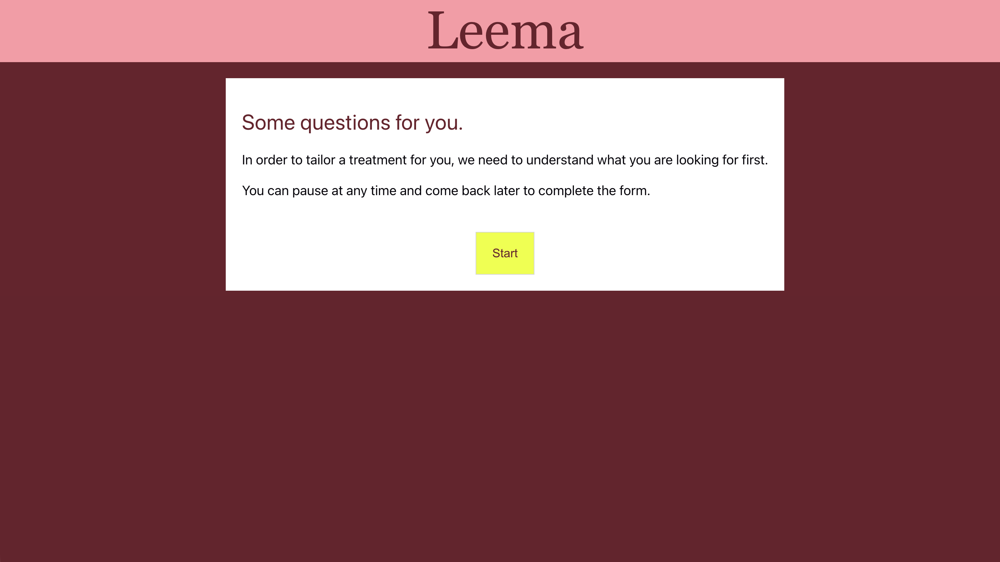
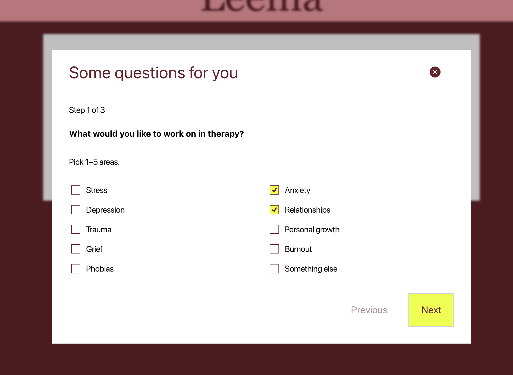
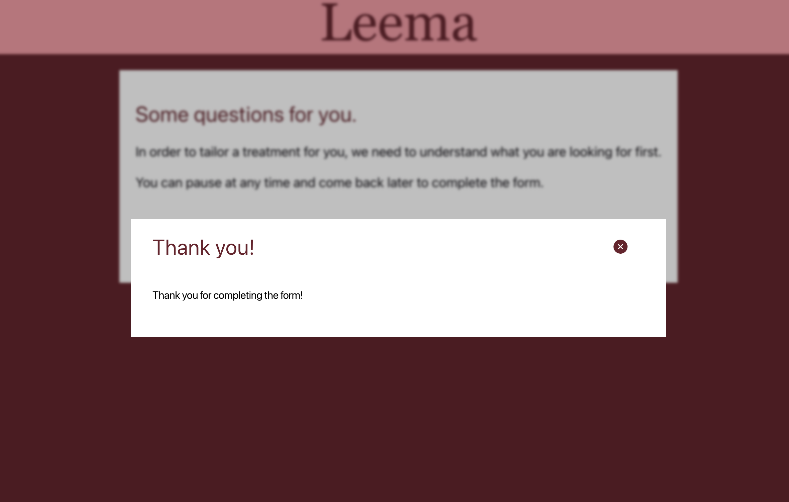

# Leema

Small product that focuses on form state management in a web applications, where you can pause and pick up later. Uses Rust for the backend and Solid.js for the frontend, communicating with a postgres database running in a Docker container.

Named it "Leema" because "Meela" was taken.

## Prerequisites

- Docker
- Node.js (Node 20.19 or higher is required)
- Rust
- SQLx CLI (`cargo install sqlx-cli`)
- Just

## Getting Started

Using the justfile, run this command in the root to start the development environment:

```bash
just dev
```
And afterwards:

```bash
just clean
```

## Trying it out

1. Open http://localhost:5173 and hit **Start**.
2. Answer a question or two, move to the next step, then just close the tab.
3. Your answers save automatically as you go (a second after you stop typing, and whenever you change step).
   The link in the address bar (`?id=…`) is your way back – no login needed.
4. Open that link again and hit **Start**: you're back where you left off.

## About the project

I put most focus on the frontend, since that is where I am most comfortable. This is the first time I've worked with Solid.js, but chose it nonetheless since it is what you are working with, but also since this would be a nice excuse to explore something new!

As you might notice, I have used very few dependencies. This was a conscious choice to keep the project lightweight and to better understand the inner workings of both Rust and Solid.js without relying heavily on external libraries.

## AI and external help

I used Claude as a discussion partner during the development, and discussed pros and cons about certain architectural decisions and implementation strategies. In a last stage, I also connected Claude code to find holes in the project.

I also "borrowed" certain design elements from Meela's official page by investigating the DOM. Some elements, such as the stepper and the exact layout of the forms, were not prioritized.

## Priorities

I spent most time at the architectural decisions and divided responsibilities to different frontend components. The visual design and minor UI details were considered less important in comparison to the overall structure and functionality of the application, so they were often simplified or omitted.

It felt wrong to not use validation on the forms, so I have to at least point out that I considered it and resisted the urge to implement it!

All questions live in a single file in the frontend, so adding or changing a question is one edit and one deploy. Frontend is the source of truth here, while backend simply stores the data and does what it is told. This enables changes to be made by a single deploy in frontend instead of redeploying the backend if something needs to be changed.

## What I would have done with more time

- Initiating discussions with stakeholders to gather what information is important to collect, and then figure out how to extract it in an effortless (and perhaps fun) way for the user.
- Robust form validation
- Handling unique users
- Polished responsive design
- Improved error handling and user feedback
- Unit testing in frontend
- Integration testing between frontend and backend
- Nice transitions and animations
- Deep dive in Solid.js best practices

## Screenshots






